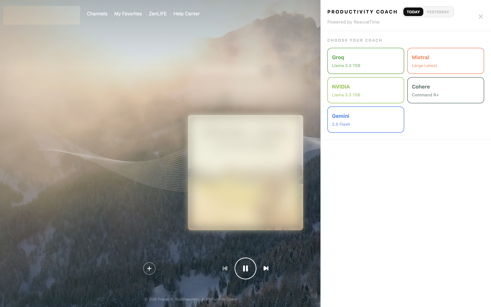

# Pranav Krishna Buddhapuram

**Orthopaedic surgeon · Adult reconstruction & clinical research**

  
  
  

During USMLE preparation, I began building personal software tools to make my own **study behavior, focus patterns, and digital accountability** more measurable.

I use **AI-assisted software development** to turn practical problems into working systems, then test, debug, validate, and refine them through sustained real-world use.

---

<table>
<tr>

<td width="50%" valign="top" align="center">

 

<strong>
<a href="https://github.com/doctorpranavb/USMLE-Prep-Pro-Tools">
USMLE Prep Pro Tools
</a>
</strong>

 

Study analytics for high-volume Q-bank preparation

</td>

<td width="50%" valign="top" align="center">

 

<strong>
<a href="https://github.com/doctorpranavb/YouTube-Accountability-Tracker">
YouTube Accountability Tracker
</a>
</strong>

 

Automated watch-time reporting for intentional YouTube use

</td>

</tr>

<tr>

<td width="50%" valign="top" align="center">

 

<strong>
<a href="https://github.com/doctorpranavb/Personal-Productivity-AI-Coach">
Personal Productivity AI Coach
</a>
</strong>

 

Behavioral analytics and AI-assisted reflection from personal activity data

</td>

<td width="50%" valign="top" align="center">

 

<strong>
<a href="https://github.com/doctorpranavb/Personal-Focus-Pattern-Explorer">
Personal Focus Pattern Explorer
</a>
</strong>

 

Time-of-day behavioral visualization for study planning

</td>

</tr>
</table>

---

### Development Approach

**problem definition → specification → AI-assisted implementation → real-world testing → debugging → validation → refinement**

These projects are portfolio case studies rather than claims of traditional line-by-line software authorship. Source code, detailed implementation logic, prompts, and private development workflows are intentionally not published.

My primary professional focus remains **orthopaedic surgery and clinical research**; these projects reflect a parallel interest in using technology to solve practical problems.
